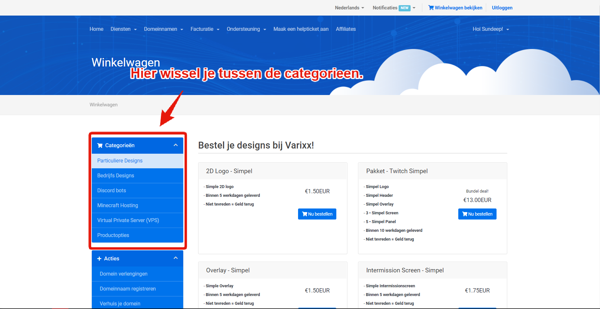

# Hoe bestel ik iets?

**Stap 1:** Ga naar https://varixx.nl/ en maak een account aan.

**Stap 2:** Vul al je gegevens netjes en eerlijk in.


Wanneer wij erachter komen dat je onzin gegevens invult verwijderen we jou account!


**Stap 3:** Wanneer je inlogt bent kan je links bovenin op "Diensten" klikken en daarna op "Bestellen". Wanneer je dit doet kom je standaard in de design categorie uit om een ander product te kiezen kan je aan de linkerkant een andere categorie kiezen.

**Stap 4:** Klik op "Nu bestellen" bij het gewenste product wat je wil hebben. En druk daarna op "afrekenen".

**Stap 5:** Druk op "Nu betalen" en volg de stappen van jou bank.  

Je hebt nu een bestelling geplaats bij varixx.nl we hopen dat je tevreden bent met je product voor vragen kan je ons altijd contacteren via info@varixx.nl

